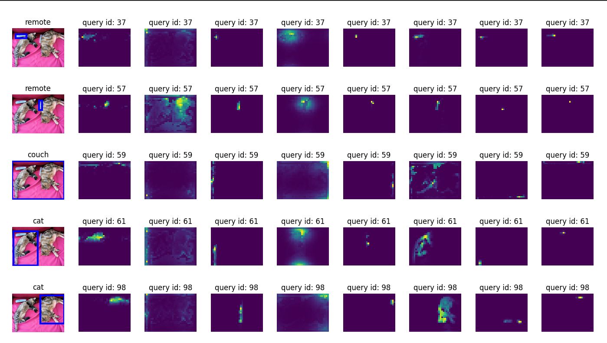
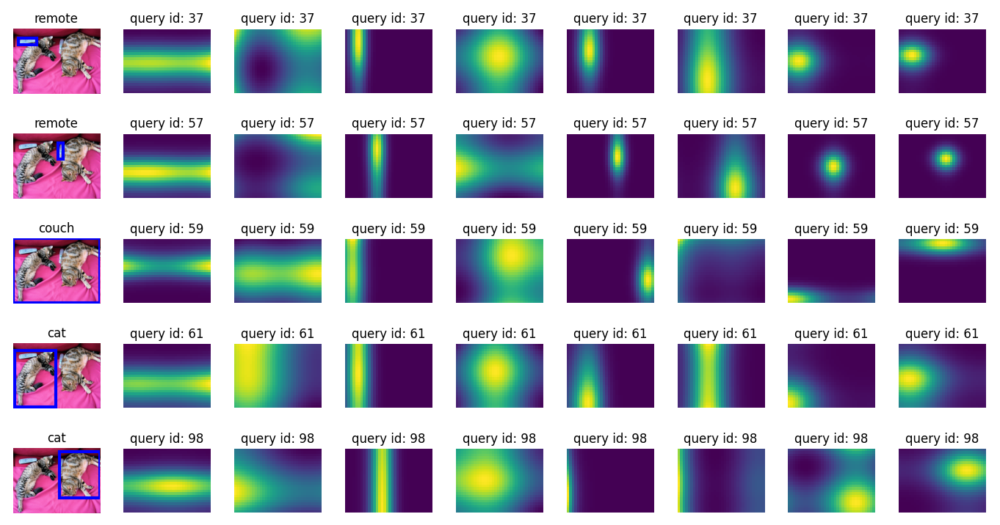
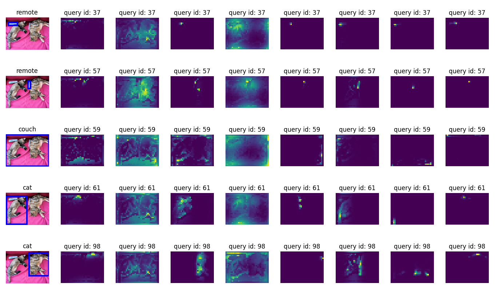
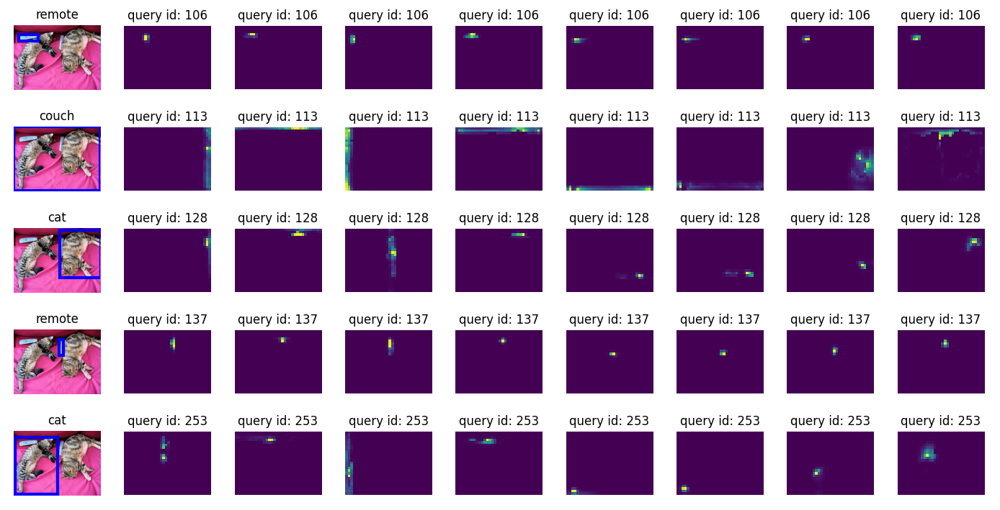
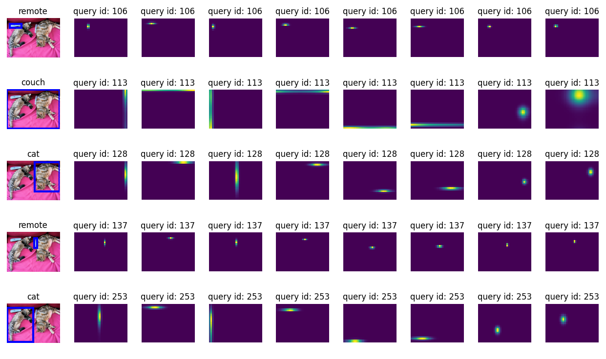
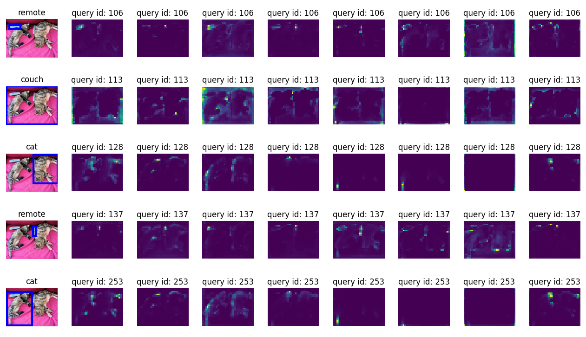

# Detr-attention
参考Detr和Conditional Detr两篇论文实现的decoder多头注意力可视化。
实现原理是decoder需要进行cross attention操作：  
query(预先设定的位置编码)，维度为300x256,会产生300个检测框；  
key(原始图片的特征信息)，维度为mx256，其中m=hxw。h,w代表原始特征的高宽。  
进行多头注意力机制之后，attenion的维度为300x8xhxw，可以理解为每个query(检测框)对应8个特征图，此工程就是将特征图显示出来。

Detr算法显示combine模式下，query和key的特征图:
> query = tgt + query_pos[:, None, :]  # q=cq+pq  
> key = memory + pos_embed             # k=ck+pk

`
python attention_scripts.py --type detr  --plot combine   
`

Detr算法显示position模式下，query和key的特征图，特征并不明显
> query = tgt + query_pos[:, None, :]  # q=pq  
> key = pos_embed                      # k=pk

`
python attention_scripts.py --type detr  --plot position  
`
  

Detr算法显示content模式下，query和key的特征图，强化了其中的head2、head4的内容信息  
> query = tgt + query_pos[:, None, :]  # q=cq
> key = memory                         # k=ck

`
python attention_scripts.py --type detr  --plot content 
`
 

Conditional Detr算法显示combine模式下，将原来的特征相加改进成了特征拼接，
这样使得对应position和content向量执行点乘操作，将attention定义的更加明确，从而提升模型的收敛速度。
> k = torch.cat([k_content, k_pos], dim=3)           # k=cat(ck, pk)  
> q = torch.cat([q_content, query_sine_embed], dim=3)   # q=cat(cq, pq)

`
python attention_scripts.py --type cd_detr  --plot combine 
`
 

Conditional Detr算法显示position模式下的特征图，位置的信息更加显著，显著的区域与预测的边框接近：
> k = torch.cat([k_pos], dim=3)              # k=pk  
> q = torch.cat([query_sine_embed], dim=3)   # q=pq 

`
python attention_scripts.py --type cd_detr  --plot position 
`
 

Conditional Detr算法显示content模式下的特征图，重点关注图中显著的内容信息：
> k = torch.cat([k_content], dim=3)     # k=ck  
> q = torch.cat([q_content], dim=3)     # q=cq 

`
python attention_scripts.py --type cd_detr  --plot content 
`
 